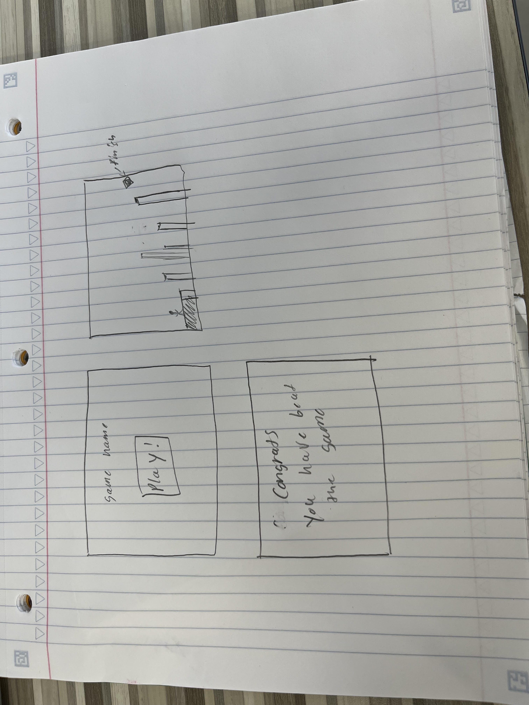
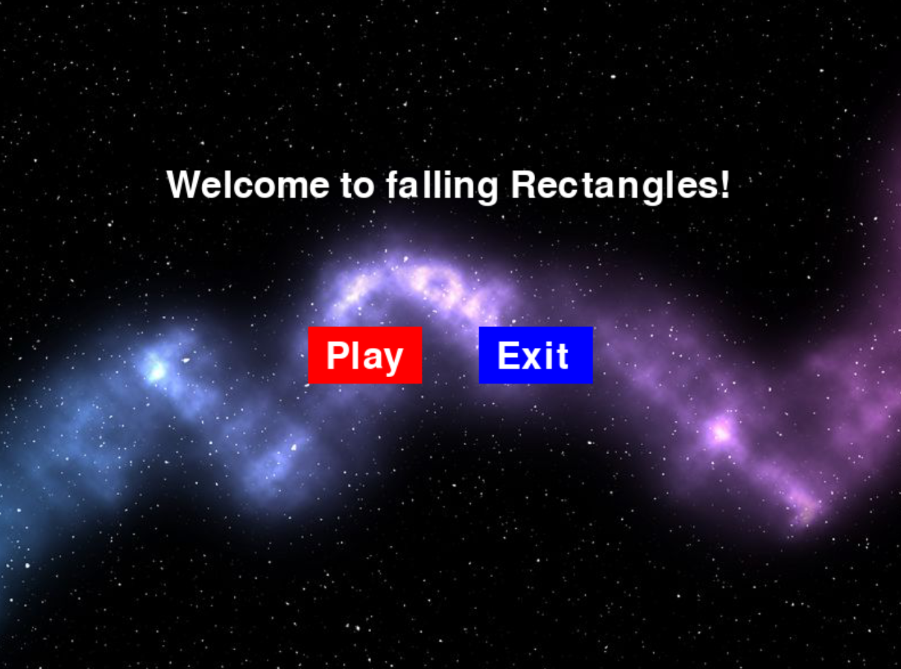
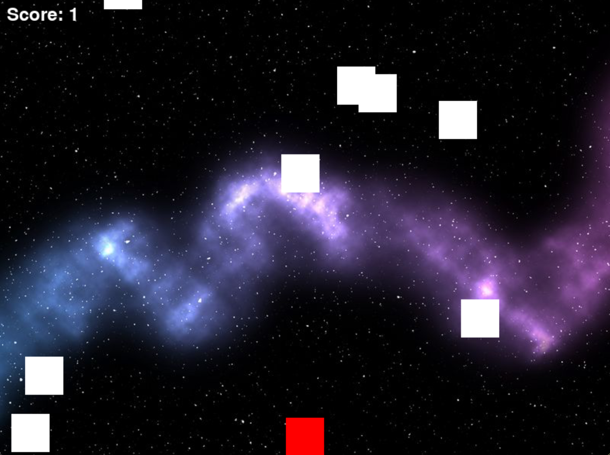

:warning: Everything between << >> needs to be replaced (remove << >> after replacing)

# << Project Title >>
## CS110 Final Project  << fall, 2023 >>

## Team Members

<< List team member names >>

*** Ethan Fried and Adnan Badnjevic

## Project Description

<< Give an overview of your project >>

***    We are making a game where boxes are randomly generated along the top of the screen and then travel down, and the player must avoid the falling blocks to survive. There will be a start menu prior to the start of the game.

## GUI Design 

### Initial Design

### Final Design

## Program Design

### Features

1. start menu
2. score
3. moveable character
4. obstacle collision
5. game over

### Classes

- << You should have a list of each of your classes with a description >>

Score
This class will be used to give the user a score based on how they are doing in the game, it will increase their score by 10 for evey second that they are alive

collision
This class will be used to make it so that the object moving towards the user will interact with the user in some way if they collide

movement
this class will be used to make the character move according to the users keypresses of the arrow keys.

## ATP

test case 1: Buttons 
Test Description: Verify that the play & exit button work as intended
Test Steps:
1. Click start button
2. Click Exit button
> Expected Outcome: The user can click on either play or exit to enter into the game or exit the game completely 

test case 2: score
Test Description: Verify that as the game progresses user gains more score
Test Steps:
1. start the game
2. play for a little but and verify that the score is increasing
Expected Outcome: The score should be increasing by 1 every block that passes that the user is alive

test case 3: movement
Test Description: Verify that stick figure is able to move left, right, and jump
Test Steps:
1. start the game
2. press arrow up
3. verify that the character jumps
4. press arrow left
5. verify that the character moves left
6. press arrow right
7. verify that the character moves right
Expected Outcome: the charachter should move in the appropriate direction after keypress

test case 4: collision
Test Description: verify that when user collides with objects that the game ends
Test Steps:
1. start the game
2. collide with an oncoming object
3. verify that the game is ended
Expected Outcome: after colliding with an object the game should end

test case 5: game over
Test Description: Verify that the game is ended after colliding with an object
Test Steps:
1. start the game
2. let yourself die to an object
3. verify that the game is ended and that there is a game over message
Expected Outcome: after the character is killed, verify that there is a game over message

